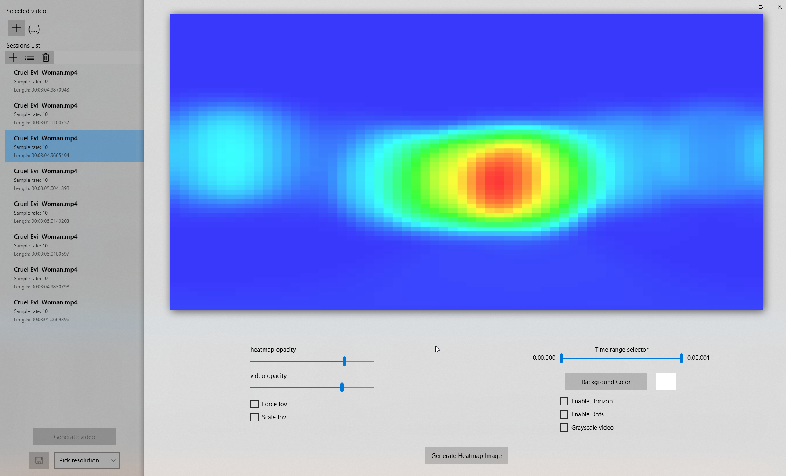
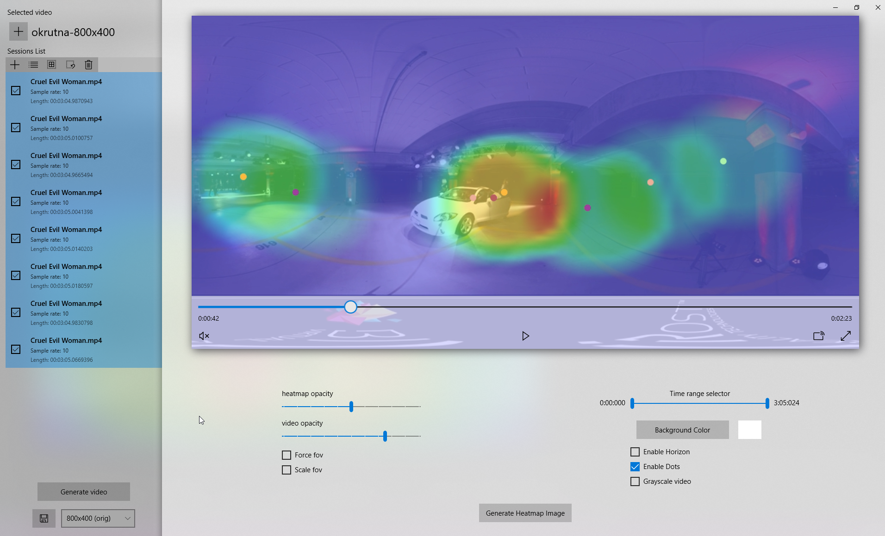
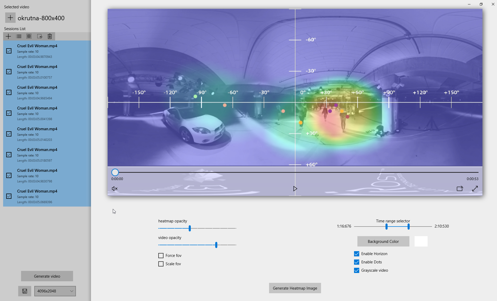
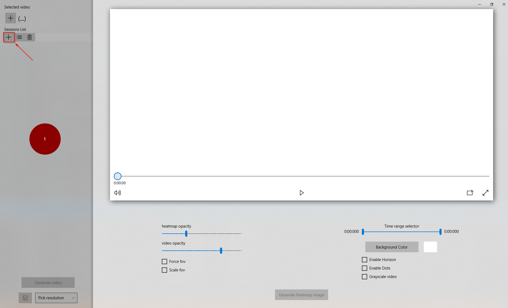
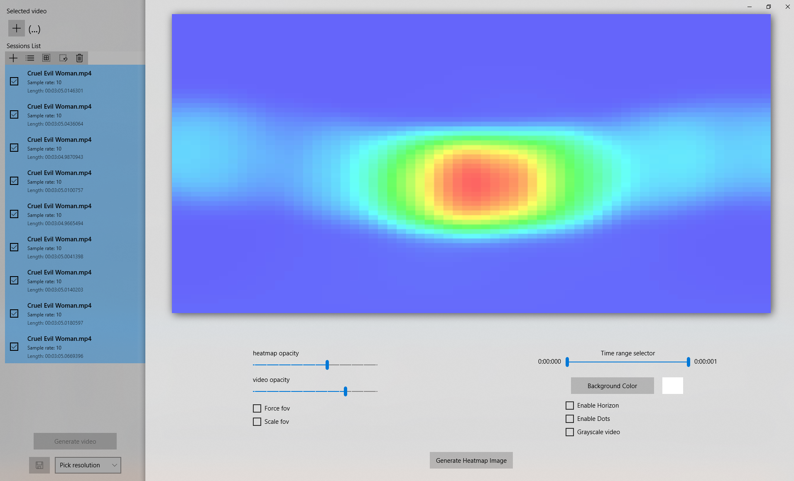
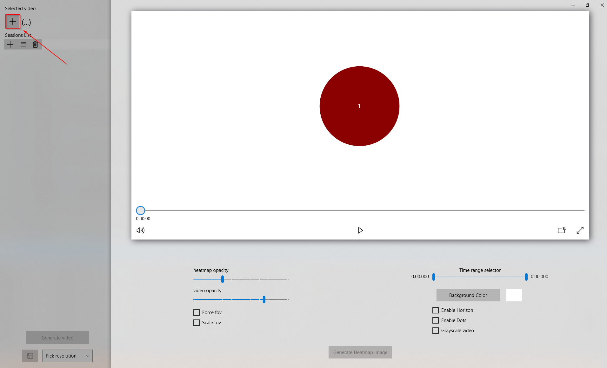
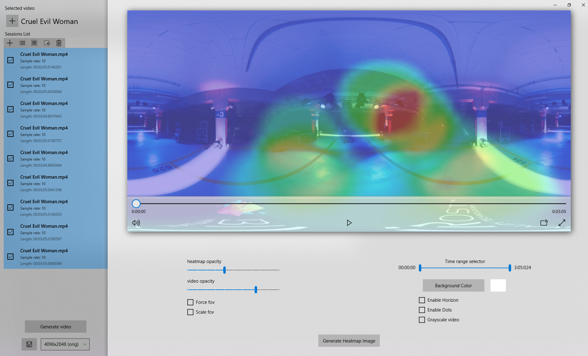

# 360Heatmaps

Gathered user sessions data can be used to create heatmaps in BIVROST 360Heatmaps tool. This tool is available as a desktop app for Windows 10.

Main features:

- viewing heatmap data generated from a single session
- viewing heatmap data from multiple sessions (multiple users)
- comparing heatmaps to a related video content
- rendering selected part of animated heatmaps as a video overlay to a file

Data sources:

* 360Player for Windows - desktop appliaction for Windows with a built-in VR session recorder from headsets and flat screen usage
* 360WebPlayer - data from a web version of a 360 player, this data can be sent to a server endpoint
* 360Player Builder - data gathered from mobile devices or mobile VR headsets in the form of a session file or uploaded to a preconfigured server endpoint, available as a part of the Player Builder
* other - 3rd party applications providing session information in a compatible data format (see Data Format)

## Usage and details
Tool provides two kinds of options that visualize the behaviour of users.

##### Creating heatmap from a signle session.

Single session mode presents a heataps from a single session of a single user. The result is a static image with a color gradient representing  the avarage time of users focus on different areas of the video.

For more accurate and useful information, heatmap generation can be done from the whole session or just from a part of it (defined by `Time range selector slider`). In most cases FOV information should be provided in session files. In case when this kind information is not present or wrong there is an option to override the FOV value or scale it depending on needs.

##### Creating an animated multi-session view

Multi-session view creates an animated heatmap from multiple sessions (single user or multiple users) with a vertical data collection. An animated heatmap can be overlayed on the top of a corresponding video with several options like blending opacity or dots representating the exact position the user is looking.

Just like a single session, multi-view can be parametrized with `Time range selector slider` and/or FOV correction.

Desktop application has an additional ability to render result to an .mp4 video file.

### Interface

Desktop version of the 360Heatmaps is built with Microsoft UWP technology to provide consistent user interface using hardware acceleration for data processing and video generation. This version also allows to select one or multiple sessions from loaded sessions set to work on (or delete if sessions are corrupted or incomplete).

Main view is used for heatmap presentation as an overlay on a related video (subject of analysis).

Visualisation preview works in real time. Any parameter change must be confirmed by pressing "Generate video" button.

360Heatmaps provides several useful tools for changing data presentation. In case of usage, options may have different meaning:
1. Creating heatmap from signle session:  

    `Time range selector` - after loading a corresponding video, allows to generate heatmap in a specified range of time  
    `Heatmap opacity` - allows to change heatmap opacity  
    `Force fov` - allows to force value of FOV  
    `Scale fov` - allows to scale value of FOV  
    `Background color` - allows to change the background color of a generated heatmap  
    `Enable horizon` - allows to enable horizon layer with axis-angles

2. Creating animated multi-session view:  

    `Time range selector` - after loading a corresponding video, allows to generate an animated heatmap in a specified range of time  
    `Heatmap opacity` - allows to change heatmap opacity  
    `Video opacity` - allows to change video opacity   
    `Force fov` - allows to force value of FOV  
    `Background color` - allows to change the background color of a generated video  
    `Enable horizon` - allows to enable horizon layer with axis-angles  
    `Enable dots` - allows to enable drawing points on heatmaps, each point indicates the exact location of headset  
    `Grayscale video` - allows to reduce video saturation (grayscale)  

## Step by step instruction
### 1. Load sessions files
Simply click a marked button or drop sessions in '1' area

After that, you are able to generate a heatmap image. Select sessions and press "Generate heatmap image" button.

### 2. Load video file
Simply click a marked button or drop video file in specified area

Now you are able to generate an animated view. Select sessions and press "Generate video" button.

You are also allowed to preview a generated video and change avaible options. If you decide to save a generated video, you can select output resolution and press the save button. Default save resolution is the resolution of an input video (marked as `orig`).

